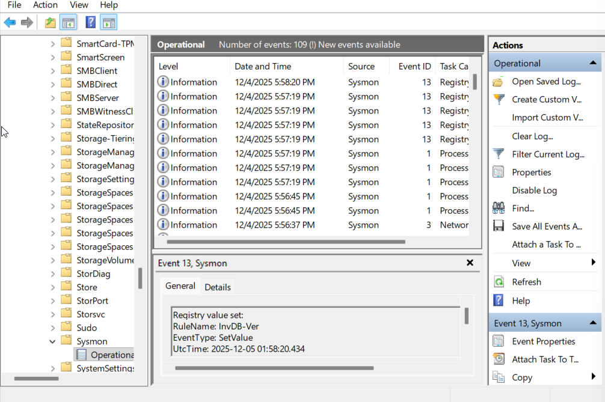
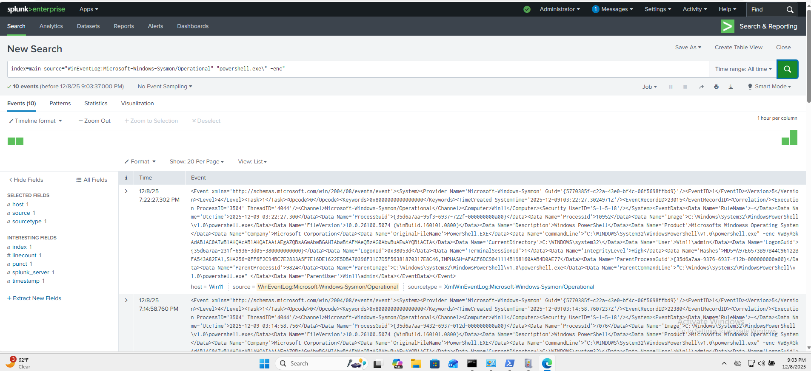
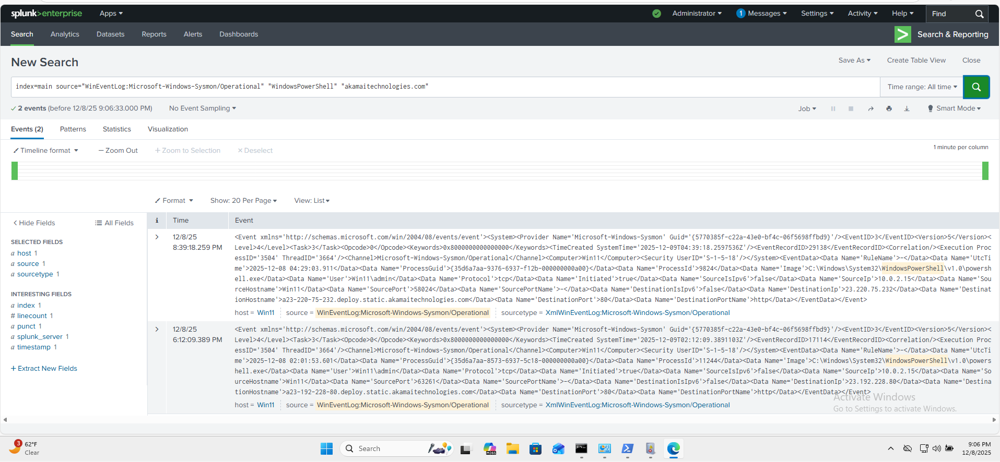

\# Threat Hunting on Windows Sysmon Logs using Splunk


This repo contains a small Windows 11 lab where I:


\- Installed \*\*Sysmon\*\* with the public \*\*SwiftOnSecurity\*\* configuration  

\- Ingested Sysmon logs into \*\*Splunk Enterprise\*\*  

\- Simulated simple attacker behaviours:

&nbsp; - Encoded PowerShell execution

&nbsp; - Outbound HTTP from PowerShell

&nbsp; - Registry Run-key persistence

\- Wrote \*\*SPL detections\*\* in Splunk and mapped them to \*\*MITRE ATT\&CK\*\*


It’s a hands-on mini \*\*SIEM / threat-hunting lab\*\* focused on Windows endpoint telemetry.


---


\## 1. Lab Architecture


\- \*\*Host:\*\* Windows 10/11 with VirtualBox  

\- \*\*Guest VM:\*\* Windows 11 (lab user, not personal account)  

\- \*\*Telemetry:\*\*  

&nbsp; - \*\*Sysmon\*\* (`Microsoft-Windows-Sysmon/Operational`)  

&nbsp; - Config: \[SwiftOnSecurity sysmon-config](https://github.com/SwiftOnSecurity/sysmon-config)  

\- \*\*SIEM:\*\* Splunk Enterprise (free, local install on the VM)  

\- \*\*Ingest path:\*\*


&nbsp; `Windows 11 → Sysmon → Windows Event Log → Splunk (WinEventLog:Microsoft-Windows-Sysmon/Operational)`


Splunk is configured with a \*\*Windows Event Log input\*\* pointing at the Sysmon Operational log and indexing into `index=main`.


---


\## 2. Simulated Suspicious Activity


These are \*\*safe, benign commands\*\* that mimic common attacker techniques so that Sysmon + Splunk have interesting data to analyze.


\### 2.1 Encoded PowerShell (T1059.001)


Attackers often use `powershell.exe -enc <Base64>` to hide their real commands.


```powershell

\# Build a simple command

$p       = 'Write-Output "HelloFromSysmonLab"'


\# Encode as UTF-16LE (Unicode) + Base64

$bytes   = \[System.Text.Encoding]::Unicode.GetBytes($p)

$encoded = \[Convert]::ToBase64String($bytes)


\# Simulate attacker-style encoded PowerShell

powershell.exe -enc $encoded

````


\*\*Sysmon:\*\*


\* Event ID \*\*1\*\* (Process Create)

\* `Image` = `C:\\Windows\\System32\\WindowsPowerShell\\v1.0\\powershell.exe`

\* `CommandLine` contains `-enc` and the Base64 string


---


\### 2.2 Outbound HTTP from PowerShell (T1041 / T1071)


Simulates a script reaching out over HTTP (common for C2 or data exfil).


```powershell

Invoke-WebRequest http://example.com -UseBasicParsing

```


\*\*Sysmon:\*\*


\* Event ID \*\*3\*\* (Network connection detected)

\* `Image` = `powershell.exe`

\* Destination host is an \*\*Akamai\*\* edge for `example.com`

\* `DestinationPort` = 80, `DestinationPortName` = `http`


---


\### 2.3 Registry Run-Key Persistence (T1547 / T1060)


Simulates malware persisting via a `Run` key entry.


```cmd

reg add HKCU\\Software\\Microsoft\\Windows\\CurrentVersion\\Run ^

&nbsp;   /v FakeApp ^

&nbsp;   /t REG\_SZ ^

&nbsp;   /d "C:\\FakePath\\fake.exe" ^

&nbsp;   /f

```


\*\*Sysmon:\*\*


\* Event ID \*\*1\*\* for `reg.exe` process execution

\* Event ID \*\*13\*\* (Registry value set):


&nbsp; \* `TargetObject` contains

&nbsp;   `HKU\\...\\Software\\Microsoft\\Windows\\CurrentVersion\\Run\\FakeApp`

&nbsp; \* `Details` = `C:\\FakePath\\fake.exe`


---


\## 3. Splunk Detections (SPL)


All queries assume:


\* Index: `main`

\* Source for Sysmon: `WinEventLog:Microsoft-Windows-Sysmon/Operational`


These searches are also stored under \[`splunk\_queries/`](./splunk\_queries).


\### 3.1 Encoded PowerShell


Detects PowerShell executions that use the `-enc` switch (common obfuscation pattern).


```spl

index=main source="WinEventLog:Microsoft-Windows-Sysmon/Operational" "powershell.exe\\" "-enc"

```


---


\### 3.2 Registry Run-Key Persistence (FakeApp)


Finds registry modifications that create or modify values under the `Run` key for `FakeApp`.


```spl

index=main source="WinEventLog:Microsoft-Windows-Sysmon/Operational" "FakeApp" "CurrentVersion\\\\Run"

```


This matches the `TargetObject` for the Sysmon Event ID 13 that sets the Run key.


---


\### 3.3 PowerShell HTTP Connection (Akamai / example.com)


Looks for network connections from PowerShell that reach the Akamai edge used by `example.com` over HTTP.


```spl

index=main source="WinEventLog:Microsoft-Windows-Sysmon/Operational" "WindowsPowerShell" "akamaitechnologies.com"

```


This can be generalized to: \*\*PowerShell + outbound HTTP to suspicious or high-risk domains\*\*.


---


\## 4. MITRE ATT\&CK Mapping


The simulated behaviours map to the following ATT\&CK techniques:


\* \*\*Encoded PowerShell\*\*


&nbsp; \* `T1059.001 – Command and Scripting Interpreter: PowerShell`


\* \*\*Registry Run-Key persistence\*\*


&nbsp; \* `T1547 – Boot or Logon Autostart Execution`

&nbsp; \* Common sub-technique: `Registry Run Keys / Startup Folder (T1060 in older ATT\&CK versions)`


\* \*\*Outbound HTTP from PowerShell\*\*


&nbsp; \* `T1041 – Exfiltration Over C2 Channel`

&nbsp; \* `T1071 – Application Layer Protocol (Web protocols / HTTP)`

---


\## 5. Ideas for Future Work


\* Expand detections to cover:


&nbsp; \* LOLBins like `certutil.exe`, `mshta.exe`, `rundll32.exe`

&nbsp; 	\* Suspicious parent/child chains (e.g., `winword.exe` → `powershell.exe`)

&nbsp;	\* Add correlation searches and alerts in Splunk (e.g., alert on encoded PS + outbound HTTP).

&nbsp; \* Forward the same Sysmon telemetry to other SIEMs (Elastic, Wazuh, Sentinel) for comparison.


---

## Screenshots

### Sysmon logging Windows events


### Splunk detection – Encoded PowerShell


### Splunk detection – PowerShell HTTP → Akamai

