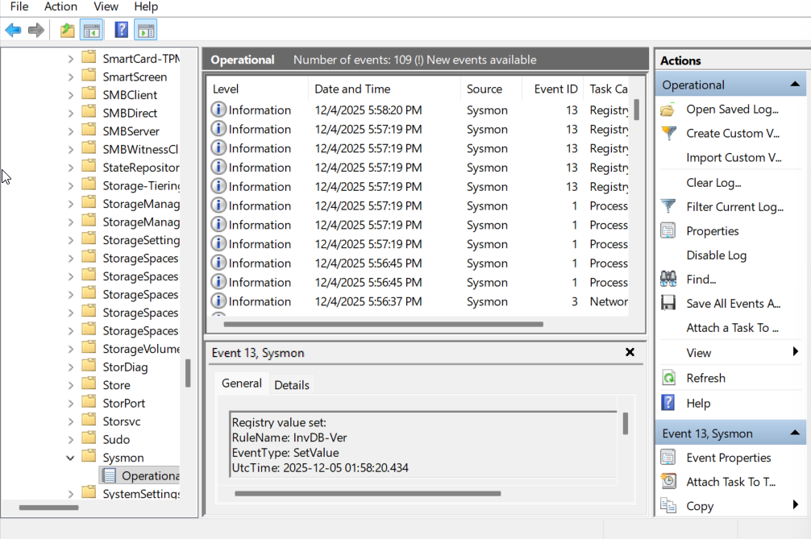
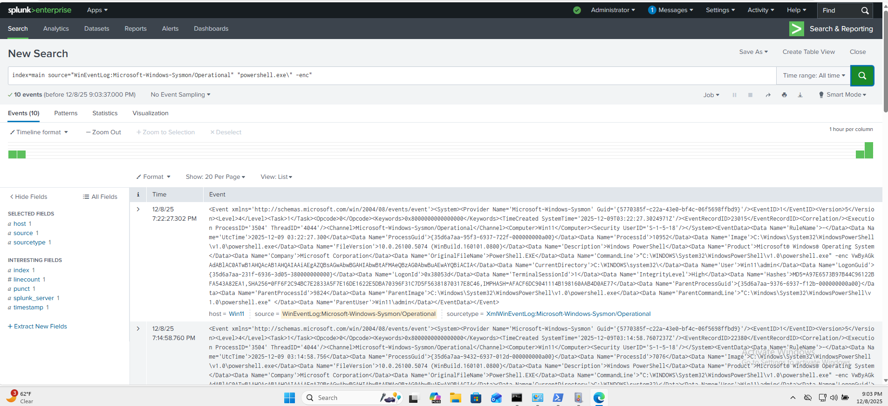
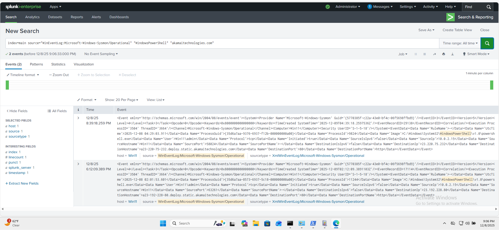

# Threat Hunting on Windows Sysmon Logs using Splunk

This repo contains a small Windows 11 lab where I:

- Installed **Sysmon** with the public **SwiftOnSecurity** configuration
- Ingested Sysmon logs into **Splunk Enterprise**
- Simulated simple attacker behaviours:
  - Encoded PowerShell execution
  - Outbound HTTP from PowerShell
  - Registry Run-key persistence
- Wrote **SPL detections** in Splunk and mapped them to **MITRE ATT&CK**

It's a hands-on mini **SIEM / threat-hunting lab** focused on Windows endpoint telemetry.

---

## 1. Lab Architecture

- **Host:** Windows 10/11 with VirtualBox
- **Guest VM:** Windows 11 (lab user, not personal account)
- **Telemetry:**
  - **Sysmon** (Microsoft-Windows-Sysmon/Operational)
  - Config: [SwiftOnSecurity sysmon-config](https://github.com/SwiftOnSecurity/sysmon-config)
- **SIEM:** Splunk Enterprise (free, local install on the VM)
- **Ingest path:**

  ```
  Windows 11 → Sysmon → Windows Event Log → Splunk (WinEventLog:Microsoft-Windows-Sysmon/Operational)
  ```

Splunk is configured with a **Windows Event Log input** pointing at the Sysmon Operational log and indexing into `index=main`.

---

## 2. Simulated Suspicious Activity

These are **safe, benign commands** that mimic common attacker techniques so that Sysmon + Splunk have interesting data to analyze.

### 2.1 Encoded PowerShell (T1059.001)

Attackers encode commands in Base64 to bypass security tools that scan for suspicious keywords in plain-text command lines.

```powershell
# Build a simple command
$p       = 'Write-Output "HelloFromSysmonLab"'

# Encode as UTF-16LE (Unicode) + Base64
$bytes   = [System.Text.Encoding]::Unicode.GetBytes($p)
$encoded = [Convert]::ToBase64String($bytes)

# Simulate attacker-style encoded PowerShell
powershell.exe -enc $encoded
```

**Sysmon:**
- Event ID **1** (Process Create)
- `Image` = `C:\Windows\System32\WindowsPowerShell\v1.0\powershell.exe`
- `CommandLine` contains `-enc` and the Base64 string

### 2.2 Outbound HTTP from PowerShell (T1041 / T1071)

Attackers use HTTP for C2 callbacks and data exfiltration because it blends into normal web traffic and is rarely blocked at the perimeter.

```powershell
Invoke-WebRequest http://example.com -UseBasicParsing
```

**Sysmon:**
- Event ID **3** (Network connection detected)
- `Image` = `powershell.exe`
- Destination host is an **Akamai** edge for example.com
- `DestinationPort` = 80, `DestinationPortName` = http

### 2.3 Registry Run-Key Persistence (T1547 / T1060)

Writing to the Run key causes a payload to execute automatically at every user logon — no admin rights required when using HKCU.

```batch
reg add HKCU\Software\Microsoft\Windows\CurrentVersion\Run ^
    /v FakeApp ^
    /t REG_SZ ^
    /d "C:\FakePath\fake.exe" ^
    /f
```

**Sysmon:**
- Event ID **1** for `reg.exe` process execution
- Event ID **13** (Registry value set):
  - `TargetObject` contains `HKU\...\Software\Microsoft\Windows\CurrentVersion\Run\FakeApp`
  - `Details` = `C:\FakePath\fake.exe`

---

## 3. Splunk Detections (SPL)

All queries assume:
- Index: `main`
- Source for Sysmon: `WinEventLog:Microsoft-Windows-Sysmon/Operational`

These searches are also stored under [`splunk_queries/`](./splunk_queries).

### 3.1 Encoded PowerShell

Detects PowerShell executions that use the `-enc` switch. Scoped to `EventCode=1` (Process Create) and the `Image` field so it only matches actual PowerShell process launches — not any log line that happens to mention these strings elsewhere.

```spl
index=main source="WinEventLog:Microsoft-Windows-Sysmon/Operational"
EventCode=1
Image="*\\powershell.exe"
CommandLine="* -enc *"
| table _time, host, User, ParentImage, CommandLine
| sort -_time
```

### 3.2 Registry Run-Key Persistence

Finds registry modifications under the Run key. Scoped to `EventCode=13` (Registry Value Set) and the `TargetObject` field so it matches the exact registry path — not any log entry that happens to contain the word "Run".

```spl
index=main source="WinEventLog:Microsoft-Windows-Sysmon/Operational"
EventCode=13
TargetObject="*\\CurrentVersion\\Run*"
| table _time, host, User, Image, TargetObject, Details
| sort -_time
```

### 3.3 PowerShell HTTP Connection

Looks for network connections initiated by PowerShell to external destinations. Scoped to `EventCode=3` (Network Connection) with private IP ranges excluded to surface only external outbound traffic.

```spl
index=main source="WinEventLog:Microsoft-Windows-Sysmon/Operational"
EventCode=3
Image="*\\powershell.exe"
NOT (DestinationIp="127.0.0.1" OR DestinationIp="::1")
NOT (DestinationIp="10.*" OR DestinationIp="192.168.*" OR DestinationIp="172.16.*")
| table _time, host, User, Image, DestinationIp, DestinationHostname, DestinationPort
| sort -_time
```

---

## 4. MITRE ATT&CK Mapping

The simulated behaviours map to the following ATT&CK techniques:

- **Encoded PowerShell**
  - T1059.001 – Command and Scripting Interpreter: PowerShell
- **Registry Run-Key persistence**
  - T1547.001 – Boot or Logon Autostart Execution: Registry Run Keys
- **Outbound HTTP from PowerShell**
  - T1041 – Exfiltration Over C2 Channel
  - T1071.001 – Application Layer Protocol: Web Protocols

---

## 5. Ideas for Future Work

- Expand detections to cover:
  - LOLBins like `certutil.exe`, `mshta.exe`, `rundll32.exe`
  - Suspicious parent/child chains (e.g., `winword.exe` → `powershell.exe`)
- Add correlation searches and alerts in Splunk (e.g., alert on encoded PS + outbound HTTP on the same host within a short window)
- Forward the same Sysmon telemetry to other SIEMs (Elastic, Wazuh, Sentinel) for comparison

---

## Screenshots

### Sysmon logging Windows events


### Splunk detection – Encoded PowerShell


### Splunk detection – PowerShell HTTP → Akamai

